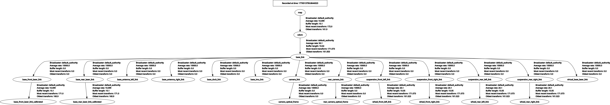
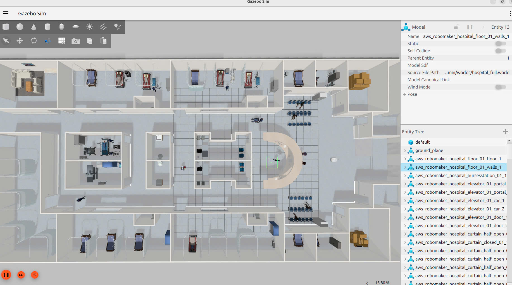
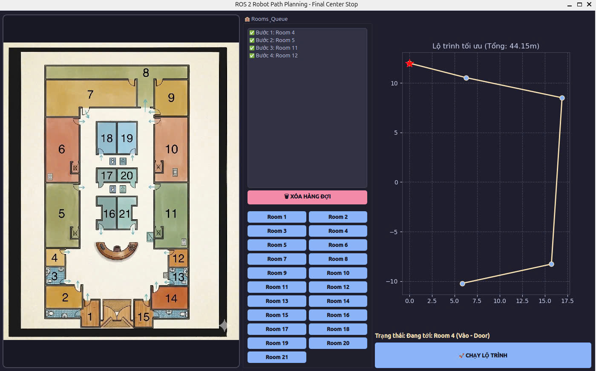
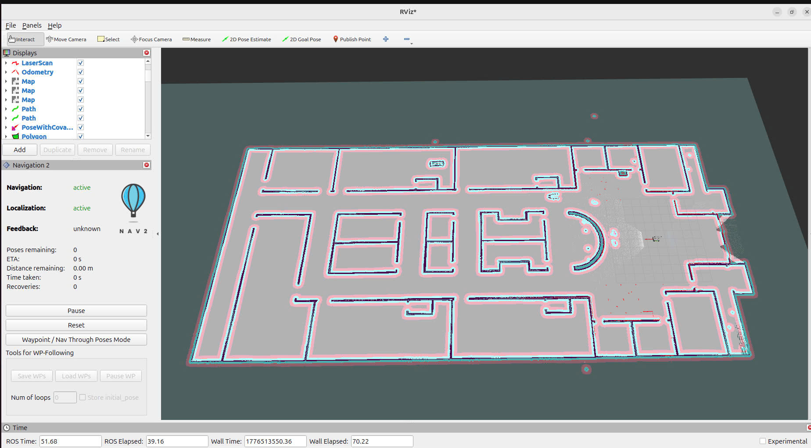
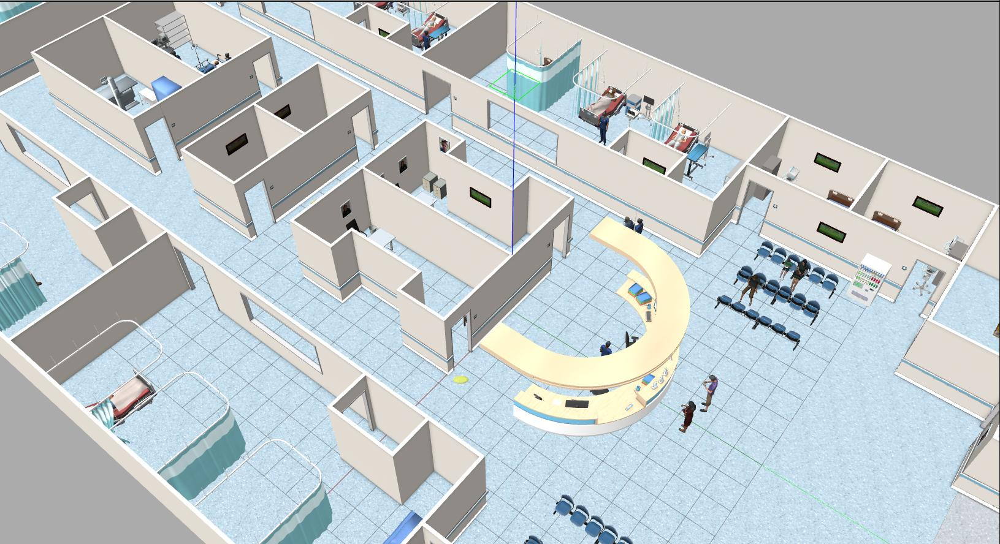
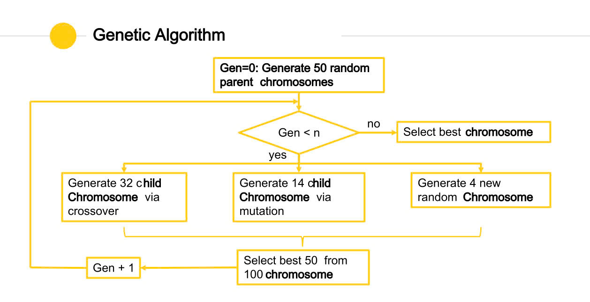
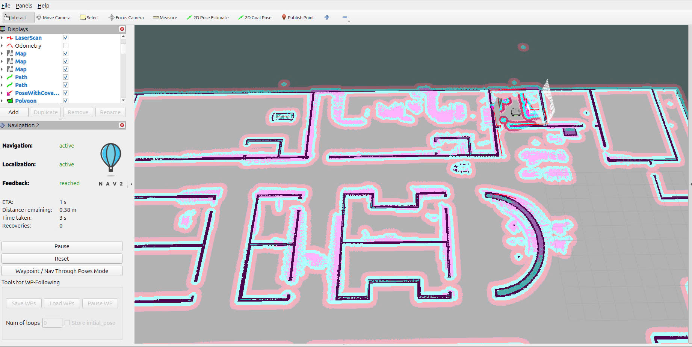
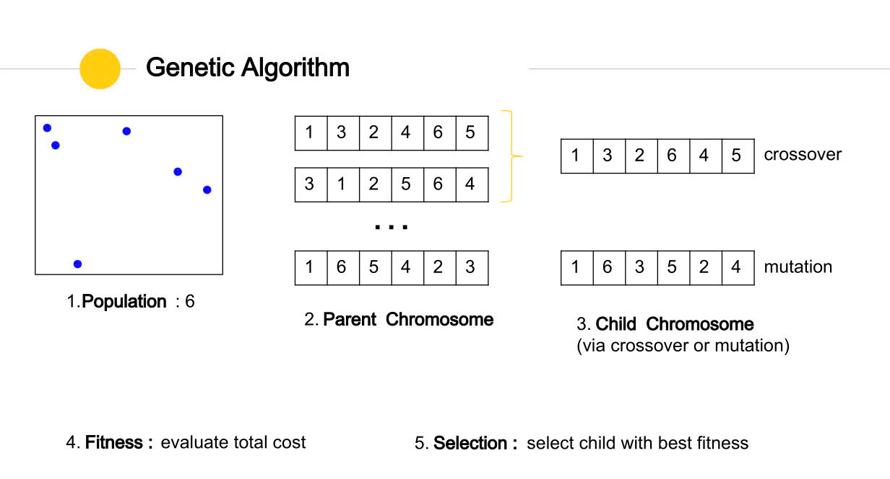

# ROS 2 Omni-Directional Robot Navigation Project

<div align="center">
  <p>An advanced autonomous navigation system featuring an omni-directional robot exploring a dynamic hospital simulation, heavily powered by ROS 2, Nav2, Custom Behavior Trees, and AI Genetic Algorithms for optimal multi-destination pathing.</p>
</div>

---

## 📖 Deep Dive Overview
This project simulates an **Omni-Directional Autonomous Delivery Robot** operating within a complex, highly populated hospital environment. While standard differential-drive robots are constrained by non-holonomic kinematics (needing to turn before moving forward), this robot's omni-directional wheels grant it **holonomic freedom**. It can translate on the X and Y axes simultaneously while rotating, enabling highly agile maneuvers through narrow hospital corridors, avoiding sudden obstacles, and parking perfectly next to hospital beds.

The project leverages **ROS 2**, **Gazebo Classic** for physics calculations, and the **Nav2 (Navigation 2)** framework. To make the autonomous dispatching intelligent, we layered a custom **PyQt5 GUI application** on top. The application deploys a **Genetic Algorithm (GA)** to solve the Medical Traveling Salesperson Problem (TSP), ensuring the robot traverses multiple queued rooms in the shortest absolute distance.

---

## 1. 🗂️ System Architecture & Framework

The system utilizes asynchronous ROS 2 action servers and topics to handle path planning, GUI communication, and sensor rendering simultaneously. 

### TF2 Coordinate Transformations
Fundamental to the robot's perception is the TF tree. It connects the world `map` frame down through the `odom` (Odometry) frame straight into the robot's `base_link` and subsequent sensors/wheels arrays. 
>  *(The standard ROS 2 node transformation tree bridging simulation to reality)*

- **`src/robot_omni/`**: The Core ROS 2 Workspace enclosing launch files, URDF structural designs, and custom Nav2 parameters.
- **`navGUI.py`**: A comprehensive GUI dispatcher. It computes route data externally and feeds `NavigateToPose` goals asynchronously to Nav2.
- **`my_nav_recovery.xml`**: Dedicated Nav2 Behavior Trees ensuring the robot never gets permanently "stuck".
- **`move.sh`**: A bash script controlling specific Gazebo physics models to test dynamic obstacle avoidance.

---

## 2. 🌍 Simulation & Environment Mapping

The hospital environment is not merely visual; it possesses heavy collision boundaries, doorways, and varying corridors. 

> 
*(Gazebo simulation populated with interactive environmental models like beds, waiting areas, and nurses).*

Before pathfinding begins, the environment is scanned via SLAM (Cartographer or Slam_toolbox) to project an accurate physical map.

> 
*(The corresponding 2D Occupancy Grid representation constructed in RViz).*

---

## 3. 🧠 Navigation 2 (Nav2) Stack Configuration

Nav2 acts as the core autopilot mechanics. It processes the LIDAR sensory data against the static map to travel safely. 

> 
*(Global topological mapping across the hospital wing).*

### Costmaps & Planners
Nav2 utilizes layered costmaps. The **Static Layer** paints the walls from the SLAM map, while the **Obstacle Layer** uses live LIDAR scans to register humans or new items. The **Inflation Layer** prevents the robot from scraping its chassis against walls.

> 
*(The inflated costmaps (cyan/purple gradients) updating in real-time as the Local Planner propels the robot towards its goal).*

### Behavior Trees & Fallback Recoveries
The robot is programmed with a custom behavior tree layout (`my_nav_recovery.xml`). If the Global or Local planner fails to find a valid velocity command (e.g., a crowd of nurses suddenly blocks the hallway), the Behavior Tree steps in to execute **Recovery States**:
1. **Back Up / Retreat:** Moves backward blindly for X meters.
2. **Spin:** Rotates 360-degrees to clear the local costmap using the LIDAR.
3. **Wait:** Pauses computing to see if the dynamic obstacles move automatically.

> 
*(Fallback logics keeping the Navigation Server robust in extreme conditions).*

---

## 4. 🔀 Route Optimization via Genetic Algorithm 

When doctors dispatch the robot to deliver meds across 5+ different rooms, relying on basic FIFO (First-In-First-Out) task ordering creates severe battery and time inefficiencies. We utilize Evolutionary Computation to fix this.

> 
*(The PyQT5 Dispatch Dashboard interface).*

Inside the GUI application (`navGUI.py`), the system bypasses exponential brute-force times through a generational timeline:
1. **Initializes Population**: Creates 50 randomized sequences of room visits.
2. **Crossover**: Splices parent sequences to inherently create better child chromosomes.
3. **Mutation**: Randomly swaps destinations to circumvent local mathematical minimums.
4. **Fitness**: Graded against standard Euclidean distances between defined nodes (Doors vs Room Centers).

> 
*(The exact generational optimization cycle implemented inside the python logic).*

The winning sequence is broken down into sub-goals (`Entry Door` -> `Room Inside` -> `Target Center`) and fired to the Nav2 Action Server.

---

## 5. 🧑‍⚕️ Dynamic Obstacle Interference Testing

To strictly validate the robot's local DWB/TEB planners, we employ an bash-level injection.
The `move.sh` script executes Gazebo Transport calls (`gz topic ...`) that continually thrust wheelchairs and medical personnel directly into the robot's path. This forces Nav2 to dynamically reconstruct its path mid-transit, slowing velocity or swerving to avoid catastrophic collisions.

---

## 6. 🚀 Setup & Execution Guide

### Step 1: Initialize the Workspace
Open a fresh terminal, traverse to the root, and build:
```bash
cd /home/tof/ros2_ws_project_demo
colcon build --symlink-install
source install/setup.bash
```

### Step 2: Bootstrap Server Backends
Activate the custom master wrapper to launch Gazebo, AMCL tracking, and Nav2 autonomously.
```bash
ros2 launch robot_omni master_launch.py
```
> **Boot Timeline:** *0s: Physics engaged | 5s: Cartographer/Localization starts | 10s: Nav2 and Costmaps fully initialized.*

### Step 3: Trigger Dynamic Entities (Testing Mode)
In a **second terminal**, inject moving obstacles into the simulation:
```bash
cd /home/tof/ros2_ws_project_demo
chmod +x move.sh
./move.sh
```

### Step 4: Run the Genetic Algorithm Dashboard
Open a **third terminal**, source ROS, and spark the user interface:
```bash
cd /home/tof/ros2_ws_project_demo
source /opt/ros/jazzy/setup.bash     # Remember to match your distro
source install/setup.bash
python3 navGUI.py
```
**Operating:** Select the desired hospital rooms from the left side. Press **"🚀 START NAVIGATION"**. The system will optimize the path within seconds and immediately control the robot autonomously!
